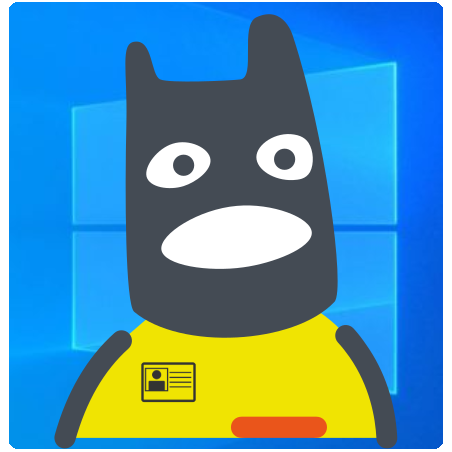
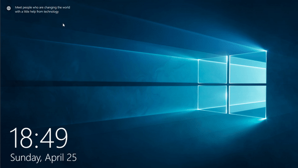
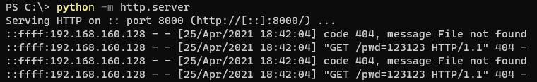

<div>
  
  <br>
  <h1>Windows 10 Creds Thief</h1>
  <p>The purpose of this file is to help you in your red teaming activity. A fake Windows 10 login page will be presented to the victim. In case shell access is obtained to a box and you want to phish the user about domain credentials, you can call this html file using 
  kiosk mode.</p>
</div>


## ❓ How it works

The only file you will need is  `index.html`. Everything is inside this file (images, scripts, styles). It is written in pure JavaScript so there are no requirements for extra libraries. After the victim types their password, the script will perform a GET request on your server you specified. You can check your server's logs for the password. Always on the first attempt it will complain for invalid password. This page uses Microsoft's default `Segoe UI` font. So the text would look realistic only in Windows. 

### 📻 Setup

- Set the account name for your user's username (line 416).
- Set the domain  where is should perform the GET request (line 312). 
- Run the script using `kiosk` mode.

#### Kiosk Mode

Kiosk mode is used by companies in order to prevent users from exiting the application. It is really common for commercial stands or self service touch screens.
Pay attention to any spaces inside your path. Better put the executables in double quotes.

##### Chrome 
```
"C:\Program Files\Google\Chrome\Application\chrome.exe" --kiosk file:///{pathToFile}
```

##### Edge
```
"C:\Program Files (x86)\Microsoft\Edge\Application\msedge.exe" --kiosk file:///{pathToFile} --edge-kiosk-type=fullscreen
```

##### Firefox
```
"C:\Program Files\Mozilla Firefox\firefox.exe" --kiosk file:///{pathToFile}
```

### 📒Extra info

- Currently `fetch` is using `No-CORS`, so feel free to change it.
- It has some basic animations, similar to those of Windows .
- Internet-Explorer does not like Base64 encoded images, so it displays them broken. 

## ✅ Demo

#### 👤 User's view


#### 📮 Server's logs



## Disclamer

This is developed for red teamers in case it would help you in one of their red team exercises. DO NOT USE IT TO SCAM PEOPLE. RESPECT OTHER PEOPLE AND DON'T BE AN IDIOT.
